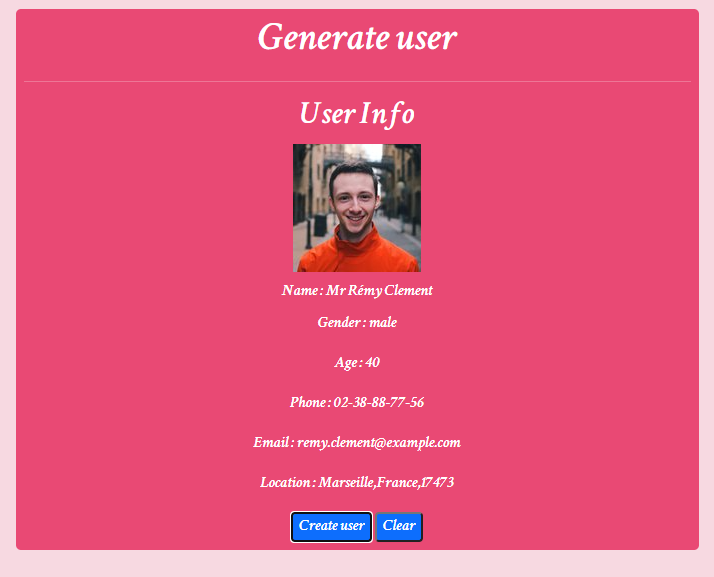

# Random_user_info

This is a javascript project to fetch data from external data using ajax and xmlhttprequest. This app allows user to generate random user info. User can get randomized user info for usage by using this app. This app displays demo user info like email,phone,photo and many more.  

</h1>Additional description about the project and its features.</h1>

<h2>Built With</h2>

- Html
- CSS
- Javascript
- Ajax
- randomuser api
- bootstrap

<h2>Live Demo</h2>
https://randomuserinfo.netlify.app/

<h2>Getting Started</h2>
To get a local copy up and running follow these simple example steps.

Clone the repository and get the files in your local branch. Use it according
to your convenience.

Prerequisites
Text editor,Github profile and Git.

<h2>Authors</h2>

👤 Author1

Github: @ajkacca457

Twitter: @ajkacca

Linkedin: https://www.linkedin.com/in/avijit-karmaker-8738a54a/

🤝<h2>Contribution</h2>
Contributions, issues and feature requests are welcome!

Feel free to check the issues page.

Show your support
Give a ⭐️ if you like this project!

📝 <h2>License</h2>
This project is a personal project of Avijit.
